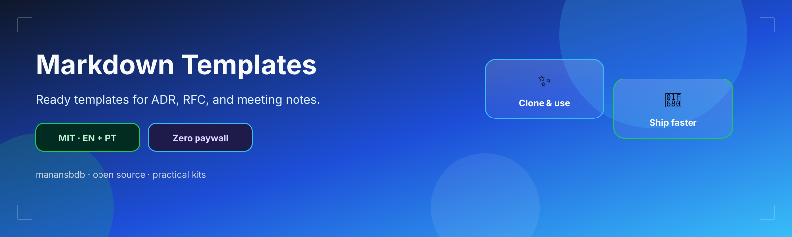
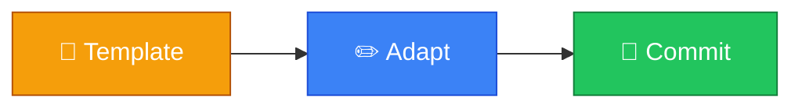

<p align="center">
  
</p>

<h1 align="center">markdown-templates</h1>

<p align="center">
  <strong>EN</strong> Ready templates for ADR, RFC, and meeting notes.<br/>
  <strong>PT</strong> Templates prontos para ADR, RFC e notas de reunião.
</p>

<p align="center">
  <a href="https://github.com/manansbdb/markdown-templates/blob/main/LICENSE"></a>
  
  
  <a href="#support--apoio"></a>
</p>

---

## What it does / Para que serve

| English | Português |
|---------|-----------|
| Ready templates for ADR, RFC, and meeting notes. | Templates prontos para ADR, RFC e notas de reunião. |



---

## Install / Instalação

### 1) Clone

```bash
git clone https://github.com/manansbdb/markdown-templates.git
cd markdown-templates
```

### Use / Usar

```bash
# open the files in this repo and copy what you need into your project
ls
```

### Requirements / Requisitos

- `git`
- No paid services required / Sem serviços pagos

---

## What's included / O que inclui

| File | EN | PT |
|------|----|----|
| `templates/ADR.md` | Architecture Decision Record | Registo de Decisão de Arquitetura |
| `templates/RFC.md` | Request for Comments | Pedido de comentários |
| `templates/MEETING_NOTES.md` | Meeting notes | Notas de reunião |

## Usage / Uso

**EN:** Copy a template, rename it, and fill the sections.

**PT:** Copia um template, renomeia-o e preenche as secções.

---

## Support / Apoio

Bitcoin donations welcome / Doações em Bitcoin bem-vindas:

```
bc1q0qfnlnxyum9u45stzxe0a7jnhtj4j0usfkqdjw
```

**Network / Rede:** BTC (Bech32).

---

## License / Licença

[MIT](./LICENSE) © 2026 manansbdb
